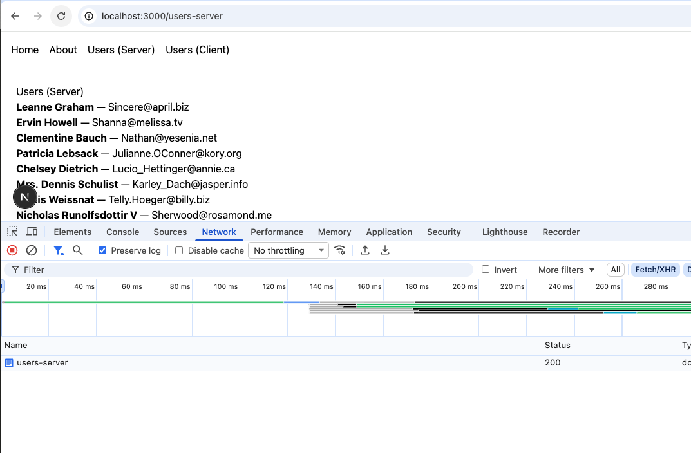
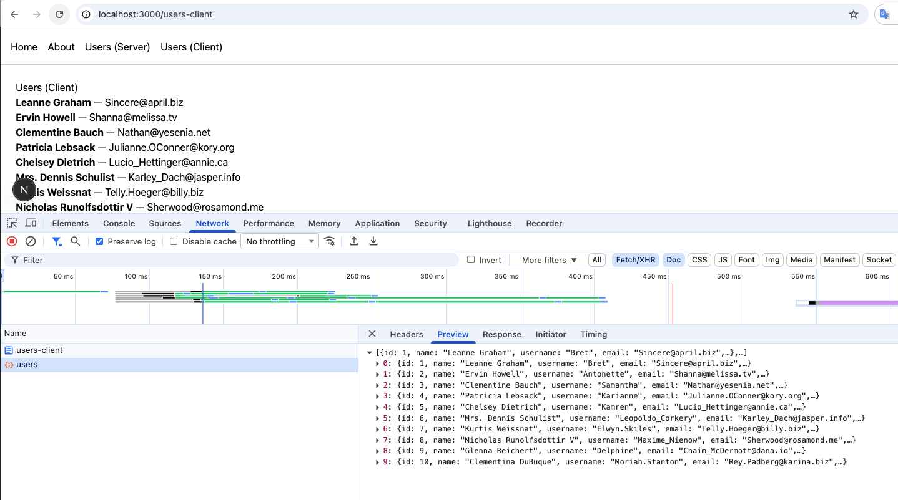

# Week 1 — Next.js Fundamentals

## What we built

A simple multi-page app with shared layout, navigation, and two approaches to fetching data.

### Project structure

```
week1/
└── src/
    └── app/
        ├── components/
        │   └── Navbar.js           # Shared navigation
        ├── data/
        │   └── users.js            # Mock user data
        ├── about/
        │   └── page.js             # About page
        ├── users-server/
        │   └── page.js             # Users list — Server Component
        ├── users-client/
        │   ├── page.js             # Users list — Client Component
        │   └── UserListClient.js   # Client Component with fetch
        ├── globals.css
        ├── layout.js               # Root layout (wraps all pages)
        └── page.js                 # Home page
```

---

## Core concepts

### 1. File-based routing

Next.js uses the folder structure inside `app/` to define routes automatically. No router config needed.

| File | Route |
|------|-------|
| `app/page.js` | `/` |
| `app/about/page.js` | `/about` |
| `app/users-server/page.js` | `/users-server` |
| `app/users-client/page.js` | `/users-client` |

### 2. Layout

`app/layout.js` wraps every page in the app. Anything placed here (like `<Navbar />`) appears on all pages without repeating code.

```jsx
export default function RootLayout({ children }) {
  return (
    <html lang="en">
      <body>
        <Navbar />
        <main>{children}</main>
      </body>
    </html>
  )
}
```

### 3. Navigation with `<Link>`

Use `next/link` instead of `<a>` for client-side navigation (no full page reload).

```jsx
import Link from "next/link"

<Link href="/about">About</Link>
```

---

## Server Component vs Client Component

This is the most important concept in Next.js App Router.

### Server Component (default)

- No `"use client"` directive needed
- Can use `async/await` directly
- Fetch runs on the server — request is invisible in browser DevTools
- HTML is fully rendered before reaching the browser
- Cannot use `useState`, `useEffect`, or event handlers

```jsx
// app/users-server/page.js
export default async function UsersServer() {
  const res = await fetch("https://jsonplaceholder.typicode.com/users")
  const users = await res.json()

  return (
    <ul>
      {users.map((user) => (
        <li key={user.id}>{user.name} — {user.email}</li>
      ))}
    </ul>
  )
}
```

### Client Component

- Must add `"use client"` at the top of the file
- Fetch runs in the browser — visible in DevTools → Network tab
- Shows loading state while waiting for data
- Can use `useState`, `useEffect`, and event handlers

```jsx
// app/users-client/UserListClient.js
"use client"

import { useState, useEffect } from "react"

export default function UserListClient() {
  const [users, setUsers] = useState([])
  const [loading, setLoading] = useState(true)

  useEffect(() => {
    fetch("https://jsonplaceholder.typicode.com/users")
      .then((res) => res.json())
      .then((data) => {
        setUsers(data)
        setLoading(false)
      })
  }, [])

  if (loading) return <p>Loading...</p>

  return (
    <ul>
      {users.map((user) => (
        <li key={user.id}>{user.name} — {user.email}</li>
      ))}
    </ul>
  )
}
```

### Comparison

| | Server Component | Client Component |
|---|---|---|
| Directive | none | `"use client"` |
| Fetch runs on | Server | Browser |
| Visible in DevTools | No | Yes |
| Shows loading state | No | Yes |
| Can use `useState` / `useEffect` | No | Yes |
| Good for | Static data, SEO | Interactivity, real-time |

### Illustration

**Server Component** — DevTools Network tab shows only the request to `/users-server`. No request to `jsonplaceholder.typicode.com` is visible because the fetch happened on the server.



**Client Component** — DevTools Network tab shows a visible request to `jsonplaceholder.typicode.com/users` with the JSON array returned as the response.



---

## Key takeaways

- Every file named `page.js` inside `app/` becomes a route automatically
- `layout.js` is the right place for shared UI like navigation
- Server Components are the default — use them unless you need interactivity
- Add `"use client"` only when you need React hooks or event handlers
- Use `<Link>` from `next/link` for navigation, not `<a>`