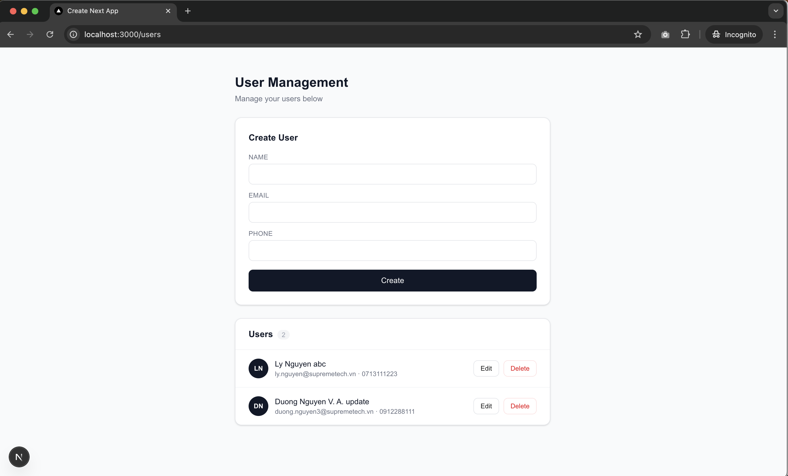

# Week 2 — Backend in Next.js

**Goal:** Use Next.js as a real backend. Apply the Action → Service → Repository pattern to separate concerns cleanly.

---

## Demo



---

## Concepts Learned

### 1. Server Actions

Server Actions are functions that run **entirely on the server**, called directly from a form or client component — no need to create a separate API route.

```js
// src/app/actions/userAction.js
"use server"

export async function createUserAction(prevState, formData) {
  const result = await createUser({
    name: formData.get("name"),
    email: formData.get("email"),
    phone: formData.get("phone"),
  })
  if (result.success) revalidatePath("/users")
  return result
}
```

**Usage in a form:**
```jsx
// Pass the action directly — no onSubmit, no fetch, no useState needed
<form action={action}>...</form>
```

> **Key insight:** Actions should be thin — receive input, call service, return result. No business logic here.

---

### 2. `useActionState` — managing Server Action state

This hook replaces the classic `useState + fetch` pattern when working with forms and server actions.

```jsx
"use client"

const [state, action, isPending] = useActionState(createUserAction, null)
// state     → value returned from the action (errors, success message)
// action    → function passed to form action={}
// isPending → true while waiting for the server response
```

**Why use this instead of `useState + fetch`?**
- No `e.preventDefault()` needed
- No manual `fetch("/api/...")` calls
- Works without JavaScript (progressive enhancement)
- `isPending` is built-in — no separate loading state to manage

---

### 3. Layered Architecture — Action → Service → Repository

Split code into 3 clear layers, each with a single responsibility:

```
Action      → receives form input, calls service, revalidates cache
Service     → validates data, contains business logic
Repository  → SQL queries only, no logic
```

**Repository** — only talks to the database:
```js
// src/app/repositories/userRepository.js
export function getAllUsers() {
  return db.prepare("SELECT * FROM users ORDER BY created_at DESC").all()
}

export function insertUser(data) {
  return db.prepare("INSERT INTO users (name, email, phone) VALUES (@name, @email, @phone)").run(data)
}
```

**Service** — owns all business logic and validation:
```js
// src/app/services/userService.js
export async function createUser(data) {
  // 1. Validate input
  const result = UserSchema.safeParse(data)
  if (!result.success) return { errors: result.error.flatten().fieldErrors }

  // 2. Business rule: email must be unique
  const existing = findUserByEmail(result.data.email)
  if (existing) return { errors: { email: ["Email already exists"] } }

  // 3. Persist
  insertUser(result.data)
  return { success: "User created successfully" }
}
```

**Benefit:** Switching from SQLite to PostgreSQL? Only touch the Repository. Changing a business rule? Only touch the Service. The Action never needs to change.

---

### 4. Validation with Zod

Zod lets you define a schema and validate data in a type-safe way:

```js
const UserSchema = z.object({
  name: z.string().min(10).max(30),
  email: z.string().email("Invalid email address"),
  phone: z.string().min(9).max(10).regex(/^\d+$/, "Numbers only"),
})

const result = UserSchema.safeParse(data)
// result.success === false → result.error.flatten().fieldErrors has per-field errors
// result.success === true  → result.data is validated and typed
```

---

### 5. `revalidatePath` — invalidating cache after a mutation

Next.js caches Server Component output. After mutating data, tell Next.js to re-fetch:

```js
import { revalidatePath } from "next/cache"

if (result.success) revalidatePath("/users")
// → Next.js re-renders /users with fresh data
```

---

### 6. SQLite with better-sqlite3

SQLite runs directly inside the Node.js process — no separate database server needed, great for learning and prototyping:

```js
// src/lib/db.js
import Database from "better-sqlite3"

const db = new Database(path.join(process.cwd(), "database.sqlite"))

db.exec(`
  CREATE TABLE IF NOT EXISTS users (
    id INTEGER PRIMARY KEY AUTOINCREMENT,
    name TEXT NOT NULL,
    email TEXT NOT NULL UNIQUE,
    created_at DATETIME DEFAULT CURRENT_TIMESTAMP
  )
`)

export default db
```

---

## Practice — User CRUD

**Task:** Build a full User CRUD following the layered architecture.

**Features shipped:**
- Create user with per-field validation (name, email, phone)
- List users with avatar initials
- Inline edit per user
- Delete user
- Error messages per field
- Success message after each action
- Empty state when no users exist

**File structure:**
```
src/
├── lib/
│   └── db.js                    # SQLite connection + table setup
└── app/
    ├── repositories/
    │   └── userRepository.js    # SQL queries only
    ├── services/
    │   └── userService.js       # Validation + business logic
    ├── actions/
    │   └── userAction.js        # Server Actions (thin layer)
    └── users/
        ├── page.js              # Server Component — fetches data
        └── UserForm.js          # Client Component — form + UI
```

---

## Key Takeaway

> **Keep actions thin, put logic in the service, keep the repository for queries only.**

When unsure where to put something:
- Touches the database? → Repository
- Business rule or validation? → Service
- Receives input / returns a response? → Action

---

## Getting Started

```bash
cd week2
npm install
npm run dev
```

Open [http://localhost:3000/users](http://localhost:3000/users)
